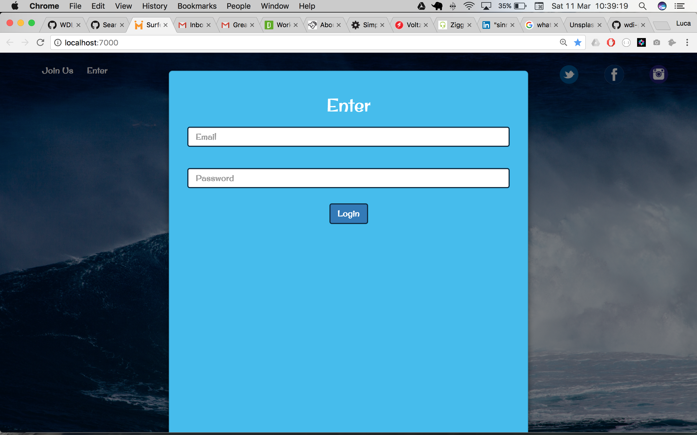
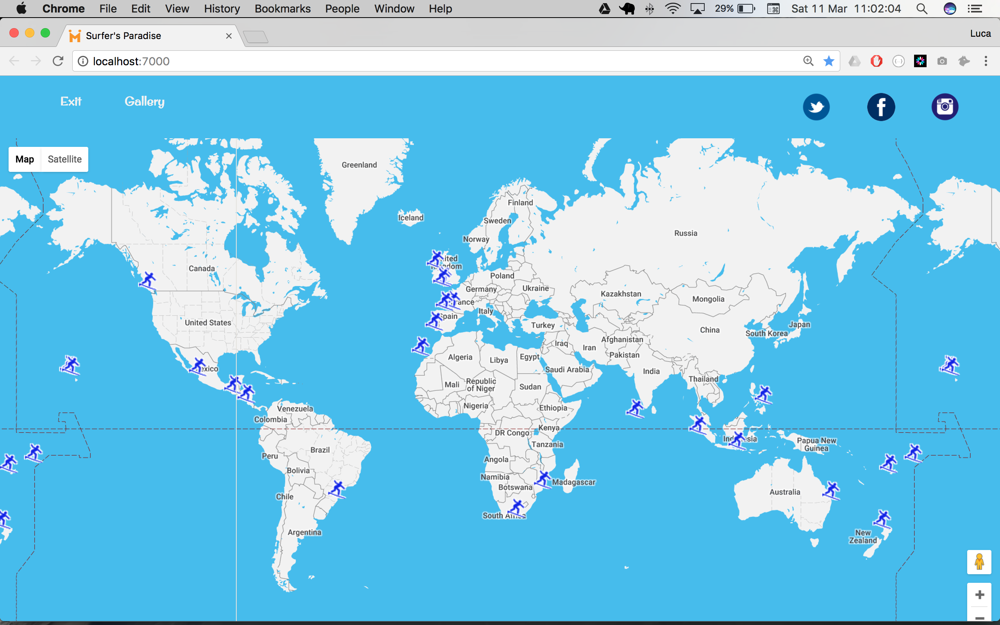
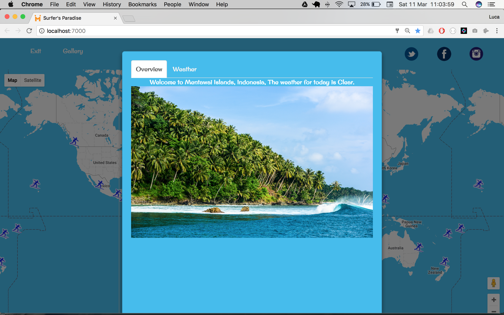
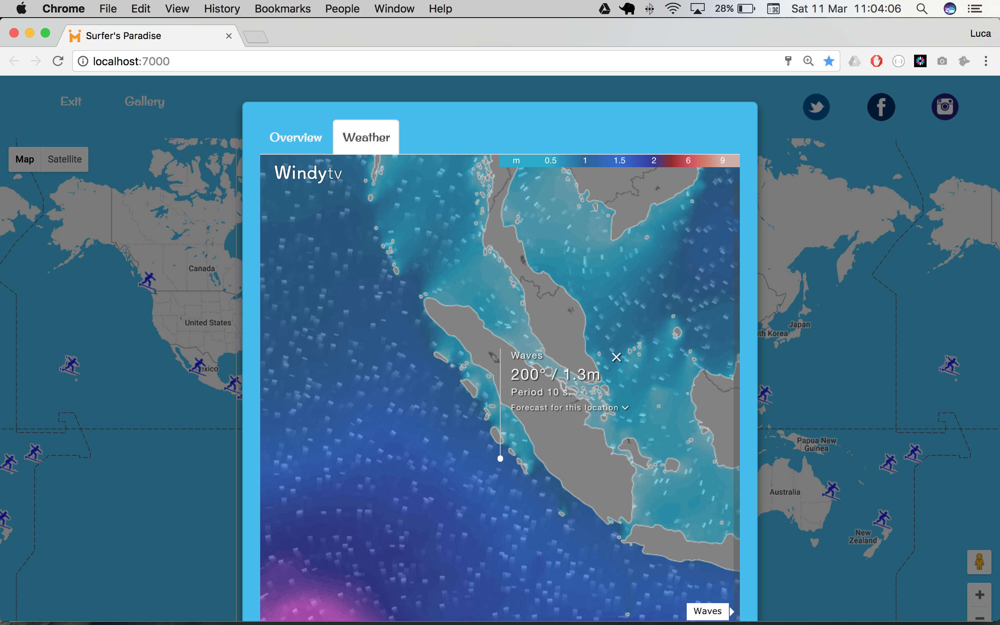
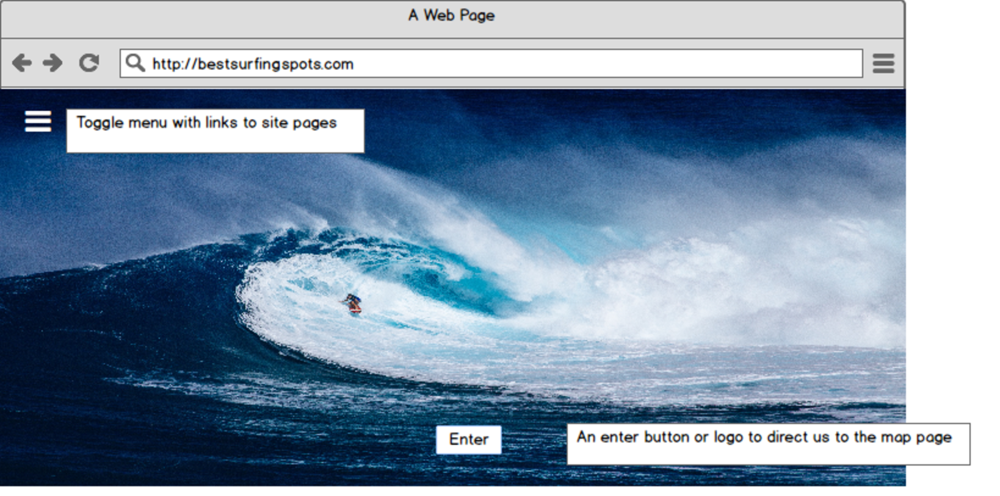
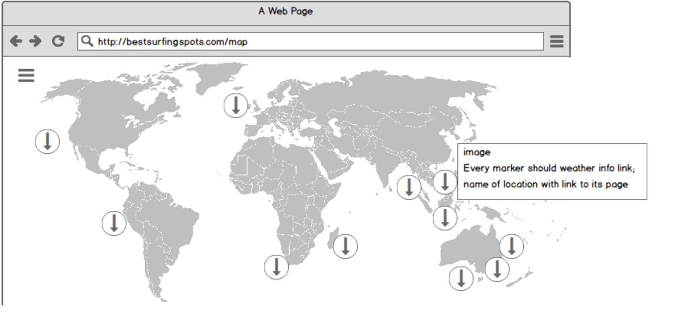
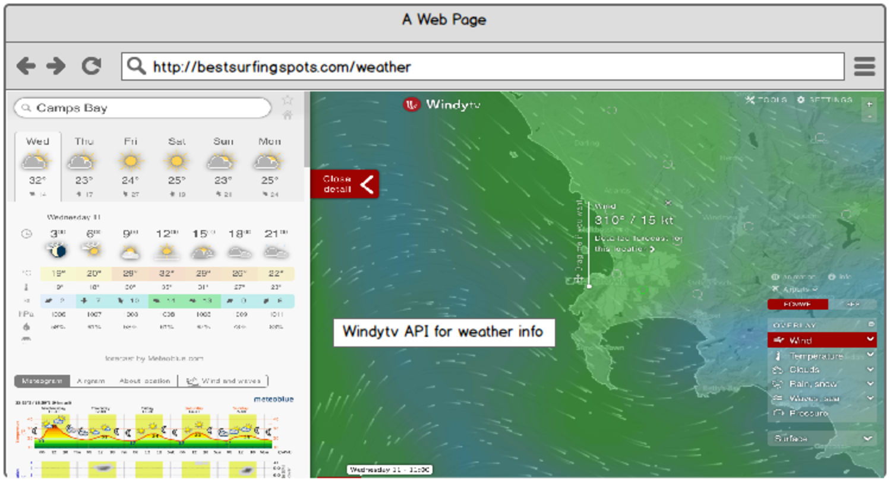

WDI_PROJECT_2

##Surfer's Paradise 

###Overview  

- A site showcasing 25 of the best surfing spots around the world pinpointed in a world map. A modal will appear once a map marker is clicked. The modal will show basic info for local weather through the DarkSky API and visualise the actual weather through the WindyTV widget. The site has a registering and login in page with authentication.
I created a landing page for the website and users will only able to enter the website only once they registered or logged in.

- Landing Page Picture

- Login form

Once logged in the user is presented with a world map where custom icons show the locations of each surfing spot.

The icons, once clicked will trigger a modal which displays the info available.

###Planning  
- Wireframes available at https://generalassembly.mybalsamiq.com/projects/wdi-ldn-24/Surfing%20spots

###API  
The wireframes look slightly different from the final project mainly due to the fact that I couldn't get the API key on time for my project at WindyTV.com. Therefore, I used the DarkSky API to get the local weather info and a WindyTV widget to visualise the info. As shown in the above pictures.

I wasn't happy with the set of data offered by the APIs I researched for the surfing spots therefore I decided to seed the data info for each location.
I used the Google Maps API to display the locations worldwide which I then styled using a snazzymaps template (https://snazzymaps.com/).  

##Technologies 

HTML5
SCSS
jQuery
Node.js
Express.js
Gulp
Bower
GoogleMaps API
DarkSky API

###Future Improvements
In the future I'd like to add more info for each location under the gallery section including the possibility to plan the ideal trip on how to get there to one or more locations.

###Credits

Many thanks to my course instructors Alex Chin and Rane Gowan for their help and advice on this project.
